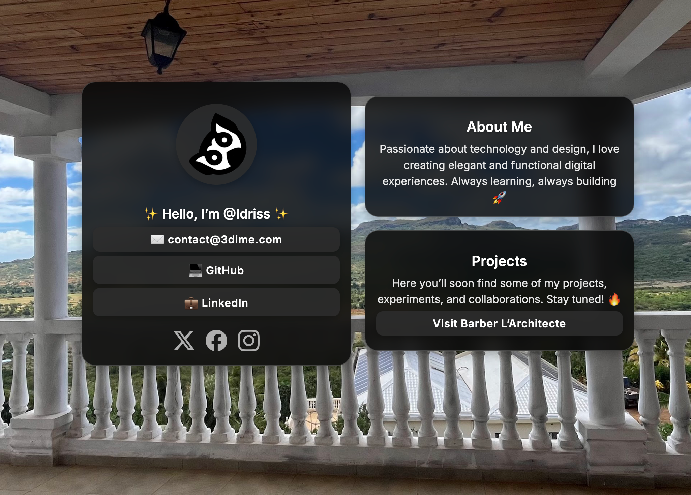

# 3dime

<p style="text-align:center">
  
</p>

<p style="text-align:center">
  <b>3dime</b> is a minimalistic social hub to regroup and share your profiles & links in one place.
</p>

---

## ✨ Features

- 👤 User profile page
- 🔗 Centralized social links
- 📱 Fully responsive design
- 🎨 Simple & clean UI

---

## 🚀 Installation

Clone the repository and move into the project folder:

```bash
git clone https://github.com/m-idriss/3dime.git
cd 3dime
```
