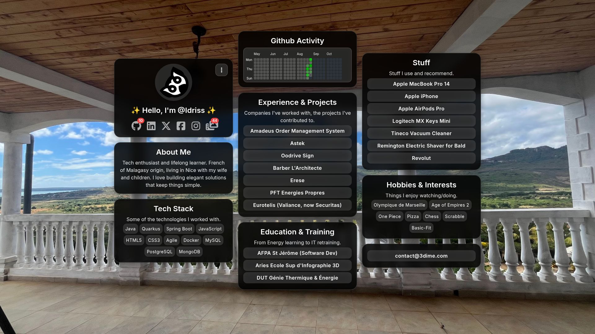
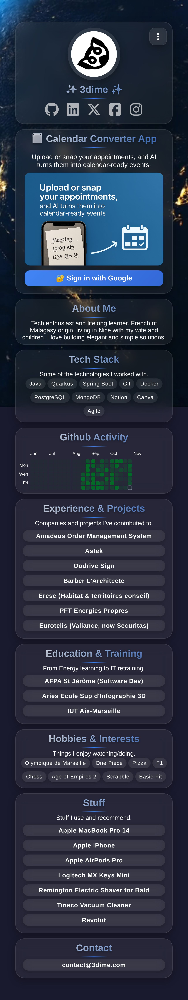

<div align="center">

# 🌟 3dime


### ✨ Modern Personal Social Hub ✨

*A minimalistic, beautiful platform to showcase your digital presence in one elegant place*

[](https://3dime.com)
[](LICENSE)
[](assets/manifest.json)
[](#features)

---

</div>

## 🎯 Overview

3dime is a sophisticated personal social hub that transforms how you share your digital identity. Built with modern web technologies and featuring stunning glass-morphism design, it creates an elegant gateway to all your profiles, projects, and professional information.

Perfect for developers, designers, content creators, and professionals who want a beautiful, fast-loading landing page that showcases their work and connects visitors to their various online presence.

## ✨ Features

### 🎨 **Modern Design**
- **Glass-morphism UI** - Stunning frosted glass effects with smooth animations
- **Responsive Layout** - Flawless experience across all devices and screen sizes
- **Dark Theme** - Professional dark aesthetic with perfect contrast ratios
- **Smooth Animations** - Subtle micro-interactions and staggered content loading

### ⚡ **Performance & Technology**
- **Progressive Web App (PWA)** - Installable, works offline, app-like experience
- **Zero Build Process** - Pure HTML5, CSS3, and Vanilla JavaScript
- **Service Worker** - Intelligent caching for lightning-fast repeat visits
- **Optimized Assets** - Compressed images and efficient resource loading

### 🔗 **Content Management**
- **JSON-Driven Content** - Easy customization through simple configuration
- **Dynamic Loading** - Content fetched asynchronously for better performance
- **Social Integration** - Showcase all your profiles with custom badges
- **Portfolio Sections** - Highlight your experience, education, and projects

### 🛡️ **Modern Web Standards**
- **Semantic HTML5** - Accessible markup with proper ARIA labels
- **CSS Custom Properties** - Maintainable styling with CSS variables
- **Mobile-First Design** - Optimized for mobile devices first
- **SEO Optimized** - Proper meta tags and structured content

## 🛠️ Technology Stack

<table>
<tr>
<td align="center">

**Frontend**
- HTML5
- CSS3 (Custom Properties)
- Vanilla JavaScript (ES6+)
- Font Awesome Icons
- Google Fonts (Inter)

</td>
<td align="center">

**PWA Features**
- Service Worker
- Web App Manifest
- Offline Support
- Install Prompts
- App Icons

</td>
<td align="center">

**Deployment**
- GitHub Actions
- FTP Deploy
- Automated Screenshots
- MIT License

</td>
</tr>
</table>

## 🚀 Quick Start

### Prerequisites
- Any modern web server (Python, PHP, Node.js, etc.)
- No dependencies to install!

### Installation

```bash
# Clone the repository
git clone https://github.com/m-idriss/3dime.git
cd 3dime

# Start local development server (choose one)
php -S localhost:8000             # PHP  
# python3 -m http.server 8000        # Python
# npx serve .                       # Node.js

# Open in browser
open http://localhost:8000
```
### ⚙️ Configuration

Copy `config.php.example` to `config.php` and update with your API credentials:

### 🎨 Customization

1. **Edit your content** in `assets/content.json`:
```json
{
  "groups": [
    {
      "sections": [
        {
          "name": "profile",
          "title": "✨ Hello, I'm @YourName ✨",
          "items": [
            {
              "name": "GitHub", 
              "url": "https://github.com/yourusername",
              "iconClass": "fa-github"
            }
          ]
        }
      ]
    }
  ]
}
```

2. **Update colors** in `assets/styles.css` using CSS custom properties
3. **Replace logo** with your own in `assets/logo.png`
4. **Modify PWA settings** in `assets/manifest.json`

## 🌐 Deployment

### Automatic Deployment (Recommended)

3dime includes **zero-config automatic deployment** via GitHub Actions:

1. **Fork this repository**
2. **Add these secrets** in your GitHub repository settings:
   ```
   FTP_SERVER     → your-ftp-server.com
   FTP_USERNAME   → your-ftp-username  
   FTP_PASSWORD   → your-ftp-password
   FTP_PATH       → /public_html/ (or your web root)
   ```
3. **Push to main branch** - Your site deploys automatically! 🎉

### Automated Quality Assurance

3dime includes **automated code quality checks** via GitHub Actions:

- **🔍 Super-Linter**: Validates HTML, CSS, JavaScript, JSON, and PHP code on every push and pull request
- **📸 Screenshot Updates**: Automatically captures and updates website screenshots daily
- **🚀 Auto-deployment**: Deploys changes to production when pushed to master branch

All workflows run automatically - no configuration needed!

### Manual Deployment

Upload all files to any web server. Works with:
- **Static hosts**: Netlify, Vercel, GitHub Pages
- **Traditional hosting**: cPanel, FTP servers
- **Cloud platforms**: AWS S3, Google Cloud Storage

## 📸 Screenshots

<div align="center">

### 🖥️ Desktop Experience


### 📱 Mobile Experience  


*Screenshots are automatically updated daily via GitHub Actions*

</div>

## 🎯 Use Cases

- **Developers** - Showcase your GitHub projects and tech stack
- **Designers** - Present your portfolio and design tools
- **Content Creators** - Link to all your social platforms
- **Professionals** - Create a digital business card
- **Students** - Display your learning journey and projects
- **Freelancers** - Professional landing page for clients

## 🔧 Advanced Configuration

### Custom Styling
```css
/* Edit assets/styles.css */
:root {
  --glass-bg: rgba(255, 255, 255, 0.15);
  --accent-color: #3b82f6;
  --text-primary: #fff;
}
```

### PWA Customization
```json
// Edit assets/manifest.json
{
  "name": "Your Name",
  "short_name": "YourName", 
  "theme_color": "#000000",
  "background_color": "#000000"
}
```

### Content Sections
The `assets/content.json` supports:
- **Profile** with social links and badges
- **About** with personal description
- **Tech Stack** with technology links
- **Experience** with companies and projects
- **Education** with institutions and courses
- **Recommendations** with tools and products
- **Hobbies** with interests and activities
- **Contact** information

## 🤝 Contributing

1. **Fork** the repository
2. **Create** a feature branch: `git checkout -b feature/amazing-feature`
3. **Commit** your changes: `git commit -m '✨ [feature/amazing] add amazing feature'`
4. **Push** to the branch: `git push origin feature/amazing-feature`
5. **Open** a Pull Request

See our [contribution guidelines](CONTRIBUTING.md) for more details.

## 📊 Performance

- ⚡ **Load Time**: < 2 seconds on 3G
- 📱 **Mobile Optimized**: 100/100 Lighthouse Mobile Score
- 🎯 **SEO Ready**: Semantic HTML with meta tags
- ♿ **Accessible**: ARIA labels and keyboard navigation
- 🔧 **PWA Score**: 100/100 Progressive Web App

## 📄 License

This project is licensed under the **MIT License** - see the [LICENSE](LICENSE) file for details.

## 👨‍💻 Author

**Idriss** - [GitHub](https://github.com/m-idriss) • [LinkedIn](https://www.linkedin.com/in/i-mohamady/) • [Website](https://3dime.com)

---

<div align="center">

**Made with ❤️ using pure HTML, CSS, and JavaScript**

*No frameworks, no build process, just modern web standards*

[](https://github.com/m-idriss/3dime)

</div>