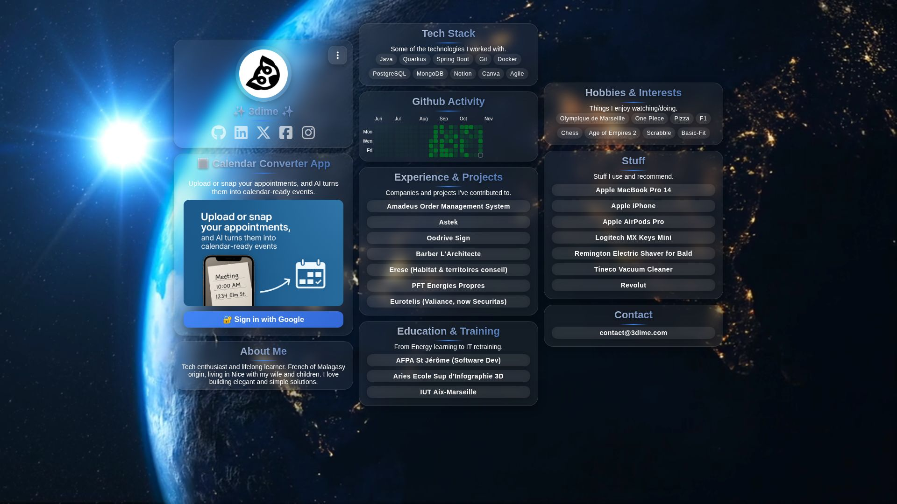

# 3dime

<p style="text-align:center">
  
</p>

<p style="text-align:center">
  <b>3dime</b> is a minimalistic social hub to regroup and share your profiles & links in one place.
</p>

[](https://3dime.com)
---

## ✨ Features

- 👤 User profile page
- 🔗 Centralized social links
- 📱 Fully responsive design
- 🎨 Simple & clean UI

---

## 🚀 Installation

Clone the repository and move into the project folder:

```bash
git clone https://github.com/m-idriss/3dime.git
cd 3dime
```

---

## 🚀 Automatic Deployment

This repository includes a GitHub Actions workflow that deploys your site via **FTP** every time you push to the `main` branch.

### 🔑 Required GitHub Secrets

You need to configure the following secrets in your repository:

* **`FTP_SERVER`** → FTP server address (e.g. `ftp.my-domain.com`)
* **`FTP_USERNAME`** → Your FTP username
* **`FTP_PASSWORD`** → Your FTP password
* **`FTP_PATH`** → Remote path on the server (usually `/www/`)

### 🛠 How to Add a Secret

1. Go to your repository on GitHub
2. Navigate to: **Settings → Secrets and variables → Actions → New repository secret**
3. Enter the **name** (e.g. `FTP_SERVER`) and paste the **value**
4. Click **Save**
5. Repeat for each secret

### ✅ How It Works

* When you push to the `main` branch, the workflow runs automatically
* It connects to your OVH hosting via FTP
* It uploads all files from your repo to the path you defined in `FTP_PATH`

---
## 📸 Desktop Screenshots

## 📱 Mobile Screenshots
